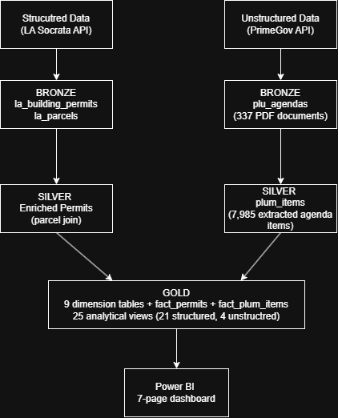
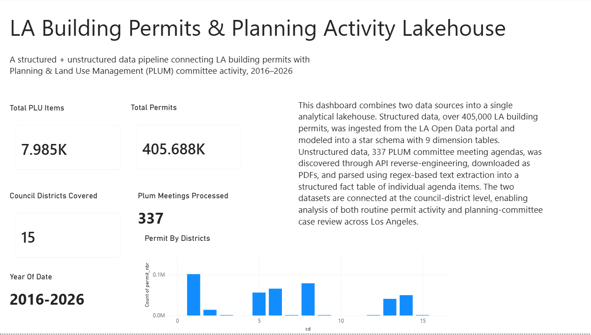
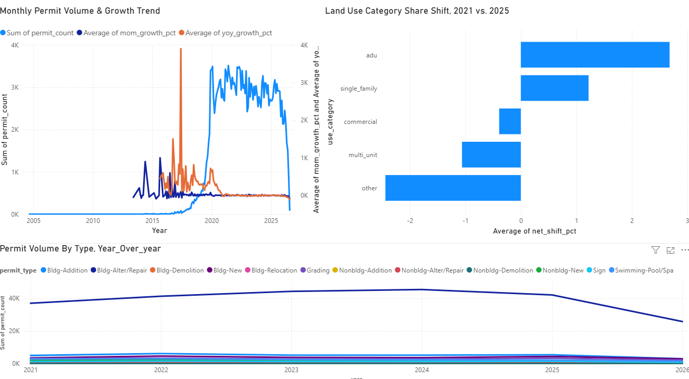
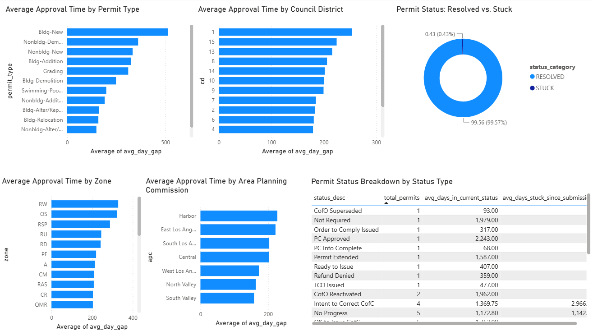
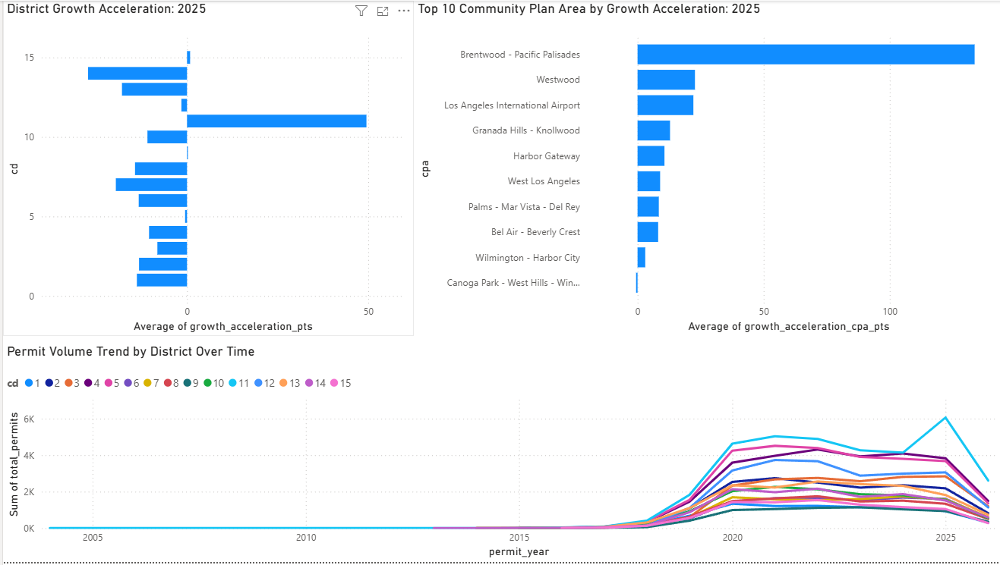
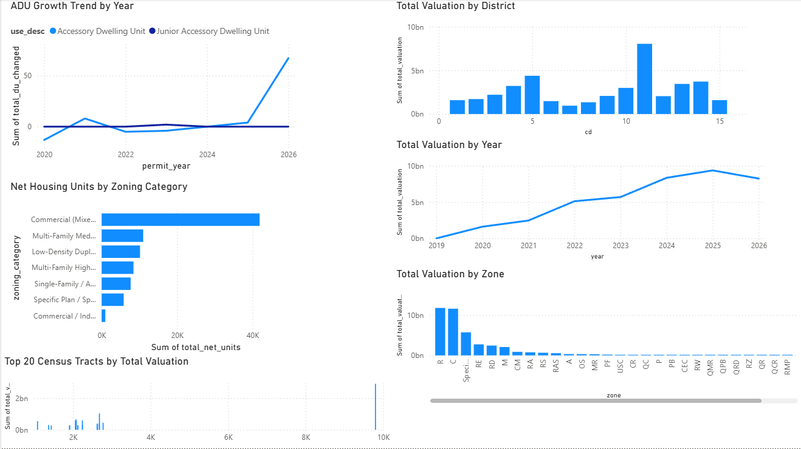
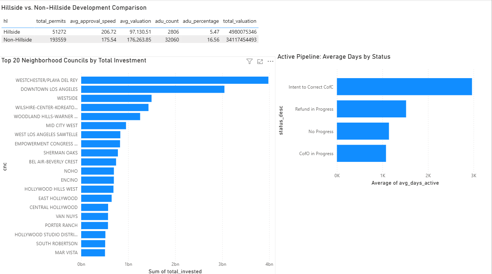
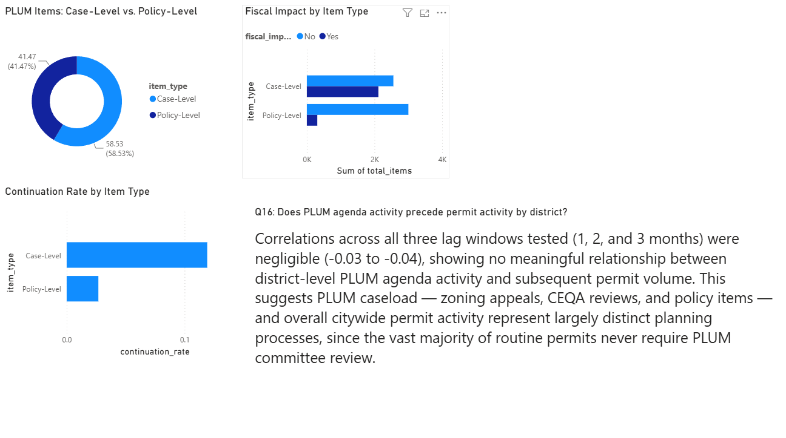

# LA Building Permits & Planning Activity Lakehouse

A structured + unstructured data engineering project connecting Los Angeles building permit activity with Planning & Land Use Management (PLUM) committee agenda data — built end-to-end on Databricks using Delta Lake, PySpark, and SQL, with analytical findings visualized in Power BI.

## Table of Contents

- [Overview](#overview)
- [Architecture](#architecture)
- [Tech Stack](#tech-stack)
- [Data Sources](#data-sources)
- [Key Technical Challenges & Solutions](#key-technical-challenges--solutions)
- [Key Findings](#key-findings)
- [Dashboard](#dashboard)
- [Pipeline Orchestration](#pipeline-orchestration)
- [How to Run This Project](#how-to-run-this-project)

## Overview

This project ingests, cleans, and models two distinct LA city data sources into a unified Bronze → Silver → Gold lakehouse architecture:

- **Structured data**: 405,688 building permits pulled from the LA Open Data Socrata API, modeled into a star schema with 9 dimension tables and a central fact table.
- **Unstructured data**: 337 Planning & Land Use Management (PLUM) committee meeting agendas, discovered through API reverse-engineering, downloaded as PDFs, and parsed via regex-based text extraction into 7,985 structured agenda-item records.

The two datasets are connected at the council-district level, enabling analysis of both routine permit activity and committee-level case review across all 15 LA council districts, spanning 2016–2026. The project answers 25 analytical questions (21 structured, 4 unstructured) and is orchestrated as a scheduled Databricks Job with explicit task dependencies.

## Architecture

This project follows a medallion (Bronze → Silver → Gold) lakehouse architecture, built entirely on Databricks with Delta Lake and Unity Catalog.

**Pipeline orchestration**: The full Bronze → Silver → Gold flow is automated as a Databricks Job with explicit task dependencies (see [Pipeline Orchestration](#pipeline-orchestration) below), scheduled to run monthly.

## Tech Stack

**Data Platform & Storage**
- Databricks (Lakehouse Platform)
- Delta Lake
- Unity Catalog

**Data Processing**
- PySpark
- SQL

**Data Sources**
- LA Open Data Socrata API (structured permits & parcels)
- PrimeGov API (unstructured PLUM meeting agendas, discovered via API reverse-engineering)

**Text Extraction**
- pdfplumber (PDF text extraction)
- Regex-based field extraction

**Orchestration**
- Databricks Jobs & Pipelines (scheduled, dependency-managed multi-task workflow)

**Visualization**
- Power BI (7-page interactive dashboard)

## Data Sources

**Structured — LA Building Permits & Parcels**
- [LA Building Permits Issued](https://data.lacity.org/resource/pi9x-tg5x.csv) — 405,688 permit records
- [LA Parcels](https://data.lacity.org/resource/qyra-qm2s.csv) — 883,642 parcel records, used to enrich permit data with geographic and zoning context

**Unstructured — Planning & Land Use Management (PLUM) Committee Agendas**
- Sourced via the PrimeGov API (`lacity.primegov.com`), discovered through browser DevTools network inspection since no public API documentation exists for this endpoint
- 337 PLUM committee meeting agendas (2016–2026) downloaded as PDF documents
- Parsed into 7,985 individual agenda items using `pdfplumber` text extraction and regex-based field parsing

## Key Technical Challenges & Solutions

This project involved real, non-trivial data engineering problems beyond simple ETL. A few worth highlighting:

**1. Star schema design correction (structured data)**
Initial dimension design combined permit type and use type into a single `dim_permit_type` table. Investigation revealed a single `use_code` mapped to 54 different `use_desc` values, causing row explosion in the fact table (3.8M rows instead of the expected ~405K). Resolved by splitting into separate `dim_permit_type` and `dim_use_type` dimensions, with fact table joins keyed on both `use_code` AND `use_desc` together.

**2. Undocumented API discovery (unstructured data)**
No public API existed for PLUM committee agendas. Reverse-engineered the data source using browser DevTools network inspection, identifying an undocumented PrimeGov API endpoint (`ListArchivedMeetingsByDays`) that returns a full decade of meeting history, then built an idempotent, rate-limited downloader for the underlying PDF documents.

**3. Unicode encoding bug silently corrupting extraction**
A subset of PLUM documents (concentrated in 2023–2024) used a Unicode soft-hyphen character (`\xad`) in place of standard hyphens, silently breaking regex-based field extraction across thousands of records. Diagnosed by tracing a suspicious data gap (two full years missing from Gold-layer aggregations) back through Silver to the raw Bronze text, and fixed with a global character normalization step applied before all downstream parsing — recovering 7,256 previously-dropped records (729 → 7,985 rows).

**4. Multi-value field parsing**
Several source fields contained comma-separated multi-value data requiring careful array-based parsing rather than simple string extraction — including LA neighborhood council fields (`cnc`), Community Plan Areas (`cpa`), and PLUM council district references (`"CDs 4, 5, 13"`). Each required a consistent split → trim → deduplicate → flag-multi pattern, with edge cases (e.g., a regex initially over-matching into unrelated title text, producing a value like `"12 2021"` instead of `"12"`) caught through targeted testing against known real examples before being trusted at scale.

**5. Data-quality cleanup across inconsistent source naming**
Both the `cnc` (neighborhood council) and `cpa` (Community Plan Area) fields contained inconsistent casing, comma-concatenated duplicates, and genuine spelling/wording variants for the same real-world places (e.g., `"Canoga Park-West Hills-Winnetka-Woodland Hill"` vs. `"...Woodland Hills"`). Resolved through a combination of automated normalization (case standardization, comma-splitting) and a manually verified mapping table for true naming variants, cross-referenced against official LA City Planning documentation.

## Key Findings

A selection of headline insights from the 25 analytical questions answered in this project (full list of questions and views in the `gold/` notebooks):

**Structured — Permits**
- ADU (Accessory Dwelling Unit) permits show the largest positive share shift of any land-use category between 2021 and 2025, consistent with statewide ADU policy changes over that period.
- Approval velocity varies significantly by permit type — new building construction takes substantially longer to approve than lower-complexity permits like signage, as expected.
- A small number of council districts and Community Plan Areas show disproportionate growth acceleration; most districts showed decelerating permit growth in 2025, with Districts 11 and 15 as notable exceptions.

**Unstructured — PLUM Committee Activity**
- PLUM agenda items split nearly evenly between case-level (zoning/CEQA review, 58.5%) and policy-level (procedural/ordinance, 41.5%) matters.
- Case-level items are continued to a future meeting roughly 4x more often than policy-level items (~12% vs. ~3%), consistent with the greater complexity and stakeholder involvement typical of case review.
- Case-level items are far more likely to report a fiscal impact (~45%) than policy-level items (~9%).
- Community Impact Statement submission rates nearly doubled from their low point in 2023 (9.3%) to 2025 (17.7%), though rates remain modest overall — the large majority of PLUM items proceed without formal neighborhood council input.

**Structured + Unstructured Combined**
- District-level PLUM agenda activity shows no meaningful correlation with permit volume 1–3 months later (correlation ≈ -0.03 to -0.04 across all lags tested), suggesting PLUM caseload and citywide permit activity represent largely distinct planning processes — the vast majority of routine permits never require PLUM committee review.

## Dashboard

A 7-page interactive Power BI dashboard built on top of the Gold layer, covering both structured and unstructured findings. Screenshots below (full-resolution images in [`/powerbi`](./powerbi)):

**1. Overview** — project summary, KPIs, and district-level orientation

**2. Permit Activity & Volume** — monthly trends, permit type growth, land-use category shifts

**3. Approval Velocity** — approval time by permit type, zone, district, and area planning commission

**4. Geographic Concentration** — growth acceleration by district and Community Plan Area

**5. Land Use & Valuation** — ADU growth, zoning density, valuation by district/zone/year/census tract

**6. Special Dimensions** — hillside development comparison, neighborhood council investment, active pipeline health

**7. PLU/PLUM Findings** — unstructured data analysis and the structured/unstructured correlation finding

## Pipeline Orchestration

The full PLU/PLUM pipeline (Bronze ingestion → Silver extraction → Gold table creation → Gold population → Gold views) is automated as a Databricks Job with explicit task dependencies, demonstrating a real, production-style orchestration pattern:

**Task chain:**
1. `bronze_plu_ingestion` — pulls meeting data via the PrimeGov API, downloads PDF agendas
2. `silver_plu_extraction` — parses PDFs into structured agenda-item records *(depends on 1)*
3. `gold_fact_plum_items_create` — creates the Gold fact table schema *(depends on 2)*
4. `gold_fact_plum_items_populated` — merges Silver data into the Gold fact table, joined against `dim_district` *(depends on 3)*
5. `gold_plu_view` — builds the 5 PLU analytical views *(depends on 4)*

**Compute**: Serverless
**Schedule**: Monthly, automatically re-ingesting new PLUM meetings and permits as they become available from LA's open data sources
**Note**: This job assumes stable reference dimension tables (e.g., `dim_district`) already exist in the Gold layer, built via the structured permits pipeline; it is not responsible for rebuilding shared reference dimensions.

## How to Run This Project

**Prerequisites**
- Databricks workspace with Unity Catalog enabled
- A free [Socrata app token](https://data.lacity.org/profile/edit/developer_settings) for the LA Open Data API
- Power BI Desktop (for viewing/rebuilding the dashboard)

**Setup**
1. Clone this repository

2. Create a Unity Catalog schema structure: `la_lakehouse.bronze`, `la_lakehouse.silver`, `la_lakehouse.gold`

3. Store your Socrata app token securely in Databricks Secrets (via the Databricks CLI or Workspace Settings → Secrets UI) — do not hardcode credentials in notebooks

4. Run notebooks in order: `bronze/` → `silver/` → `gold/` (dim → fact → populate → views), or use the pre-configured Databricks Job (see [Pipeline Orchestration](#pipeline-orchestration)) to run the PLU pipeline end-to-end

5. Connect Power BI Desktop to your Databricks SQL Warehouse via the built-in Databricks connector, authenticating with a Databricks Personal Access Token (generate under **Settings → Developer → Access Tokens**, scope: BI Tools)

**Credentials & Secrets**: This project uses the LA Open Data Socrata API (requires a free app token) and a Databricks Personal Access Token for Power BI connectivity. Both are stored securely via Databricks Secrets rather than hardcoded in notebooks or committed to version control.
